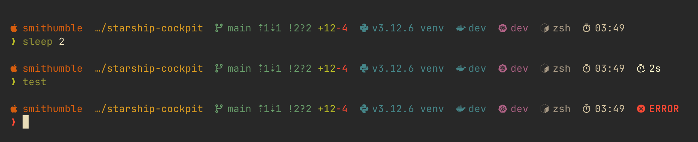
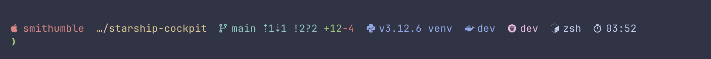
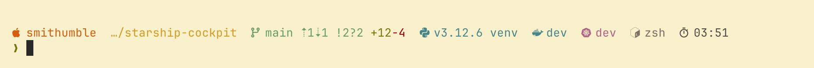

# Cockpit preset for [Starship](https://starship.rs/)

This is a preset for the [Starship](https://starship.rs/) cross-shell prompt.



## Requirements

Install and enable a [Nerd Font](https://www.nerdfonts.com/) in your terminal.

Install [Starship](https://starship.rs/) and configure your shell to use it.

> [!TIP]
> More information about Starship installation and configuration can be found [here](https://starship.rs/guide/#%F0%9F%9A%80-installation).

## Installation

Copy the `starship.toml` file to your Starship configuration directory.

> [!TIP]
> More information about Starship configuration files can be found [here](https://starship.rs/config/#configuration).

## Palettes

This preset includes predefined palettes that you can enable by setting the `palette` value in your `starship.toml` file.

> [!NOTE]
> Background color is not included in the palette. You can set it in your terminal settings.

### Default



```toml
palette = "default"
```

> [!IMPORTANT]
> The default palette uses standard terminal colors, ensuring it blends with your terminal color scheme. In the image you can see the [Catppuccin Mocha](https://raw.githubusercontent.com/mbadolato/iTerm2-Color-Schemes/master/schemes/catppuccin-mocha.itermcolors) iTerm2 color scheme.

### Gruvbox Dark


```toml
palette = "gruvbox_dark"
```

### Gruvbox Light



```toml
palette = "gruvbox_light"
```
